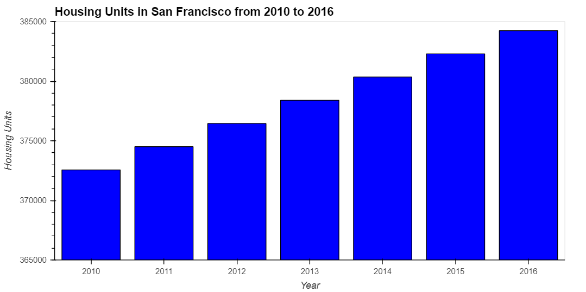
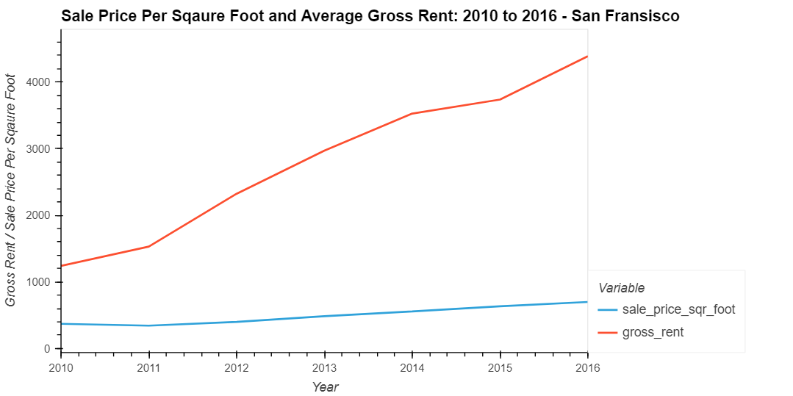
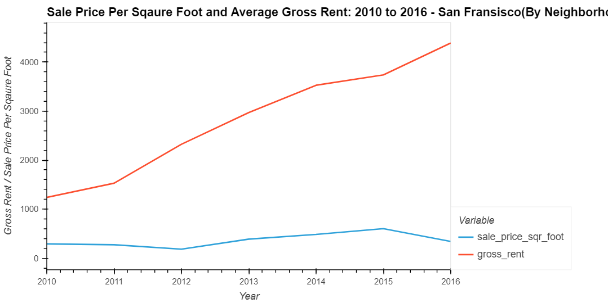
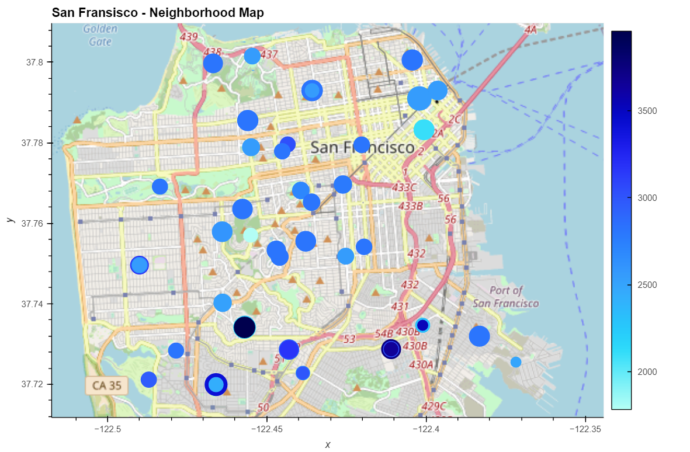

# Unit 6: Housing Rental Analysis for San Francisco

## Background

**Proptech**, the application of technology to real-estate markets, is an innovative domain in the fintech industry. The company wants to offer an instant, one-click service for people to buy properties and then rent them. They want to have a trial of this offering in the San Francisco real estate market. If the service proves popular, they can then expand to other markets.

I have used Python visualization skills to find properties in the San Francisco market that are viable investment opportunities.

---
### Visualize and analyze the real-estate data

#### Calculate and plot the housing units per year
I have used numerical and visual aggregation to calculate the number of housing units per year, and then visualize the results as a bar chart.

#### Calculate and plot the average prices per square foot
I have used numerical and visual aggregation to calculate the average prices per square foot, and then visualize the results as a bar chart.

#### Compare the average prices by neighbourhood
I have used interactive visualizations and widgets to explore the average sale price per square foot by neighbourhood.

#### Build an interactive neighbourhood map
I have explored the geospatial relationships in the data by using interactive visualizations with hvPlot and GeoViews.

